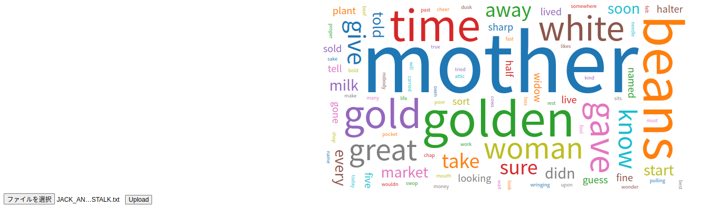

## これはなに?

英語テキストからワード数に応じた大きさの文字画像を出力する WordCloud を実行するアプリケーション

## 実行方法

### python の WordCloud を用いる場合

1. 本ディレクトリにて`docker build -t word-cloud-python .` を実行して Docker image をビルドする。

2. `docker run -it --rm -v ${PWD}:/workspace word-cloud-python` を実行して `./data`配下の文書データを WordCloud 化したデータを`./dst`配下に生成する。

3. `./dst`配下の生成画像を確認する。

### ブラウザにて実行したい場合

1. ./frontend_version に移動

2. 移動先で`docker build -t word-cloud-js .` を実行して Docker image をビルドする。

3. `docker run -it --rm -p 8080:80 word-cloud-js` を実行して`http://localhost:8080/`にアクセスする。

4. 以下の画面に遷移するのでファイルを選択 => Upload ボタンをクリックする。

5. 下記の画像が表示されることを確認する。

### 補足

フロントエンドの WordCloud は ChatGPT により作成している。

入力したプロンプトは、`./frontend_version/prompt.md` にあるので興味があればどうぞ
